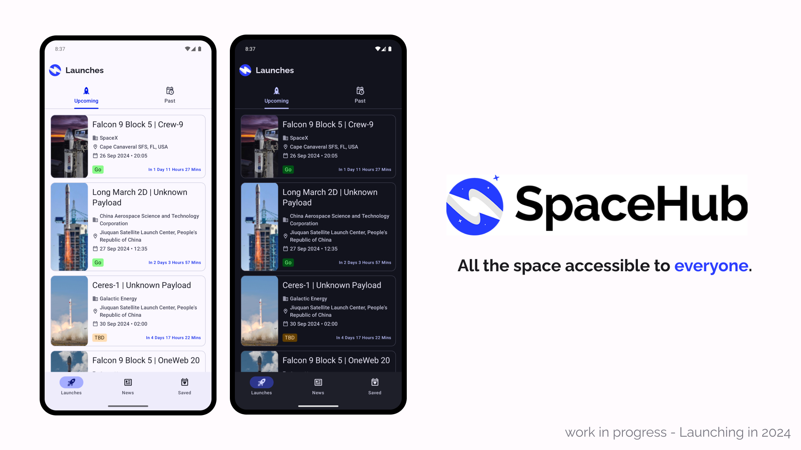
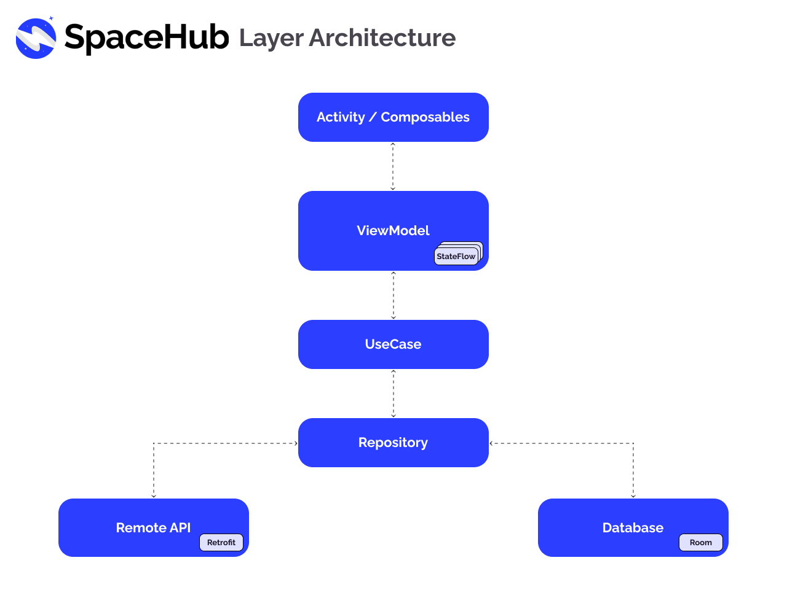

## SpaceHub - Spaceflight Tracker 🚀

<p align="center">
<b>SpaceHub is an open-source app that aims to improve knowledge and accessibility on spaceflights for people around the globe.</b>
The source code is open source under the GPLv3 Licence and is built by following modern Android Development like Jetpack Compose, Hilt, Coroutines, Flows and its designed with the new Material Design 3 guidelines.
</p> 



## Disclaimer - Project Under Development 🚧
This project is a work in progress and under development. It may contain uncompleted features, bugs and it may be subject to changes during this stage. **The first v1 stable version will be released in the Google Play Store soon.**

## Tech stack
- Minimum SDK 24
- Compose
- 100% Kotlin
- Multi-module
- [Bitrise](https://bitrise.io/) for CI/CD
- [Material Design 3](https://m3.material.io)
- Dark/Light mode support
- [Coroutines](https://github.com/Kotlin/kotlinx.coroutines) + [Flow](https://kotlin.github.io/kotlinx.coroutines/kotlinx-coroutines-core/kotlinx.coroutines.flow/) for asynchronous operations
- [HILT](https://developer.android.com/training/dependency-injection/hilt-android) for Dependency Injection
- Architecture
    - MVVM
    - Clean Architecture
    - Repository Pattern
- Jetpack
    - [Navigation](https://developer.android.com/guide/navigation): For handling Navigation inside the app
    - [LifeCycle](https://developer.android.com/topic/libraries/architecture/lifecycle): For managing UI related data in a LifeCycle conscious way
    - [Room](https://developer.android.com/training/data-storage/room): For creating a Database by providing an abstraction layer over SQLite
- [Retrofit / OkHttp3](https://github.com/square/retrofit): For performing network request
- [Robolectric](http://robolectric.org): For Unit Test
- [Mockito](https://site.mockito.org): Mocking framework for Unit Test
- [Turbine](https://github.com/cashapp/turbine): Turbine is a small testing library for kotlinx.coroutines Flow.
- [Coil](https://coil-kt.github.io/coil/): For network image loading
- Material Components: For building the UI
- [Spotless](https://github.com/diffplug/spotless): For code-formatting and for keeping the code style consistent across the project
## Layer Architecture
This app is based on MVVM architecture and follows Clean Architecture principles with the repository pattern


## Design
For designing this app, I used Figma, one of the industry standard design tools for creating UI and UX for mobile and Desktop.
You can check the artboard on [Figma here](https://www.figma.com/design/yTpD4uhyWSin3asXrNAGv4/SpaceHub-App?node-id=5-2096&t=EseyInTO018SD2c2-1)

## API
SpaceHub uses APIs from [Launch Library 2](https://thespacedevs.com/llapi) and [Spaceflight News API
](https://thespacedevs.com/snapi) for collecting the Spaceflights information.

## Find this repository useful?
Support it by giving a star ⭐️ and follow me on [Github](https://github.com/LPirro "Github")

## License
```xml
SpaceHub - Designed and Developed by LPirro (Leonardo Pirro)
Copyright (C) 2023 Leonardo Pirro

This program is free software: you can redistribute it and/or modify
it under the terms of the GNU General Public License as published by
the Free Software Foundation, either version 3 of the License, or
(at your option) any later version.

This program is distributed in the hope that it will be useful,
but WITHOUT ANY WARRANTY; without even the implied warranty of
MERCHANTABILITY or FITNESS FOR A PARTICULAR PURPOSE.  See the
GNU General Public License for more details.

You should have received a copy of the GNU General Public License
along with this program.  If not, see <http://www.gnu.org/licenses/>.
```
You can read the full licence [here](https://github.com/LPirro/SpaceHub/blob/develop/LICENSE.md "here")
